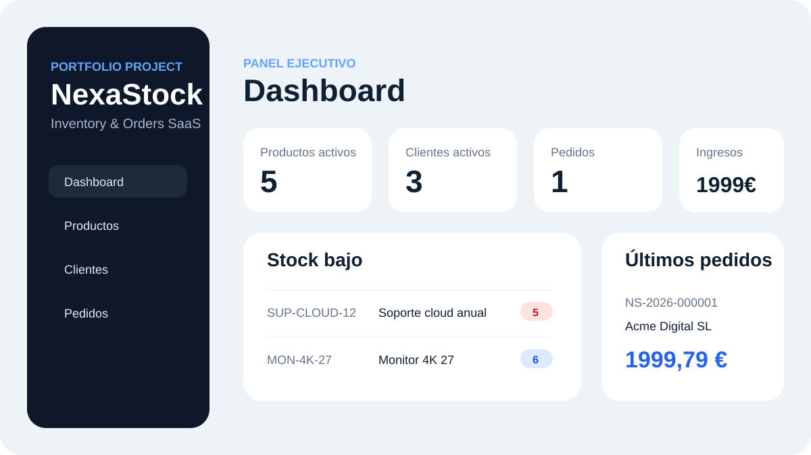

# NexaStock Fullstack

NexaStock es una aplicación personal de gestión de inventario,
clientes y pedidos. Combina un backend Java 21 con Spring Boot
y un frontend React con TypeScript.

Permite consultar productos, gestionar clientes y crear pedidos
con descuento de stock. Incluye autenticación JWT, datos de
demostración y pruebas automatizadas del backend.


Ilustración del panel en SVG; no es una captura de la aplicación ejecutándose.

---

## Propuesta de valor

Muchas pequeñas empresas gestionan productos, clientes y pedidos con hojas de cálculo. NexaStock centraliza ese flujo en una plataforma web con control de stock, pedidos, movimientos de inventario, roles de usuario y panel de métricas.

El objetivo del proyecto no es solo “hacer pantallas”, sino demostrar capacidad para construir una solución completa con arquitectura limpia, reglas de negocio, persistencia, seguridad y despliegue reproducible.

---

## Stack técnico

### Backend

- Java 21
- Spring Boot 3
- Spring Security
- JWT
- Spring Data JPA
- PostgreSQL
- H2 para pruebas automatizadas
- Bean Validation
- OpenAPI / Swagger UI
- JUnit 5 + Mockito

### Frontend

- React 18
- TypeScript
- Vite
- React Router
- Axios
- CSS modular simple sin frameworks pesados

### DevOps / Calidad

- Docker Compose
- Dockerfile para backend y frontend
- GitHub Actions CI
- REST Client collection
- Documentación de arquitectura
- Separación por capas

---

## Funcionalidades implementadas

- Login con JWT.
- Roles: `ADMIN` y `MANAGER`.
- Dashboard con KPIs:
  - productos activos,
  - clientes,
  - pedidos pendientes,
  - facturación acumulada,
  - productos con stock bajo,
  - últimos pedidos.
- CRUD de productos.
- CRUD de clientes.
- Creación y consulta de pedidos.
- Descuento automático de stock al crear un pedido.
- Registro de movimientos de inventario.
- Validaciones de datos.
- Gestión centralizada de errores.
- Documentación OpenAPI.
- Datos iniciales para demo.

---

## Usuarios de prueba

Cuando arranca el backend, se crean automáticamente estos usuarios:

| Rol | Email | Contraseña |
|---|---|---|
| ADMIN | `admin@nexastock.dev` | `Admin123!` |
| MANAGER | `manager@nexastock.dev` | `Manager123!` |

---

## Cómo ejecutarlo con Docker

Requisitos:

- Docker
- Docker Compose

```bash
docker compose up --build
```

Servicios:

- Frontend: `http://localhost:5173`
- Backend API: `http://localhost:8080/api`
- Swagger UI: `http://localhost:8080/swagger-ui/index.html`
- PostgreSQL: puerto `5432`

---

## Cómo ejecutarlo en local sin Docker

### Backend

```bash
cd backend
mvn spring-boot:run
```

### Frontend

```bash
cd frontend
npm install
npm run dev
```

Crea un archivo `.env` en `/frontend` si quieres cambiar la URL de la API:

```env
VITE_API_URL=http://localhost:8080/api
```

---

## Estructura del proyecto

```text
nexastock-fullstack/
├── backend/
│   ├── src/main/java/com/portfolio/nexastock/
│   │   ├── auth/
│   │   ├── config/
│   │   ├── customer/
│   │   ├── dashboard/
│   │   ├── exception/
│   │   ├── order/
│   │   ├── product/
│   │   ├── stock/
│   │   └── user/
│   └── src/test/
├── frontend/
│   ├── src/components/
│   ├── src/context/
│   ├── src/pages/
│   ├── src/services/
│   └── src/types/
├── docs/
├── .github/workflows/
├── docker-compose.yml
└── README.md
```

---

## Endpoints principales

| Método | Endpoint | Descripción |
|---|---|---|
| POST | `/api/auth/login` | Login y generación de token JWT |
| GET | `/api/dashboard` | KPIs del dashboard |
| GET | `/api/products` | Listado paginado de productos |
| POST | `/api/products` | Crear producto |
| PUT | `/api/products/{id}` | Actualizar producto |
| DELETE | `/api/products/{id}` | Desactivar producto |
| GET | `/api/customers` | Listado paginado de clientes |
| POST | `/api/customers` | Crear cliente |
| PUT | `/api/customers/{id}` | Actualizar cliente |
| GET | `/api/orders` | Listado de pedidos |
| POST | `/api/orders` | Crear pedido y descontar stock |
| GET | `/api/orders/{id}` | Detalle de pedido |


---

## Integración continua

El workflow `.github/workflows/ci.yml` realiza dos comprobaciones:

- Backend: compilación, ejecución de pruebas y generación del JAR
  con Java 21 y Maven.
- Frontend: comprobación de TypeScript y compilación con Vite.

Se ejecuta al enviar cambios a main y en las pull requests
dirigidas a esa rama. También permite ejecución manual.

No realiza despliegues ni pruebas funcionales del frontend.

## Alcance y limitaciones

Proyecto personal de aprendizaje y demostración, sin uso
productivo acreditado.

- Las pruebas del backend utilizan H2; no validan todos los
  comportamientos específicos de PostgreSQL.
- Quedan pendientes pruebas de extremo a extremo entre
  frontend y backend.
- La generación de números de pedido necesita mejorarse
  para evitar colisiones entre peticiones simultáneas.
- Los usuarios de demostración son para entornos locales.

---

## Ideas para ampliarlo

- Refresh tokens.
- Exportación de pedidos a PDF.
- Subida de imagen de producto.
- Auditoría avanzada por usuario.
- Filtros por fecha y estado de pedido.
- Tests de integración con Testcontainers.
- Pipeline CI/CD con despliegue automático.

---


