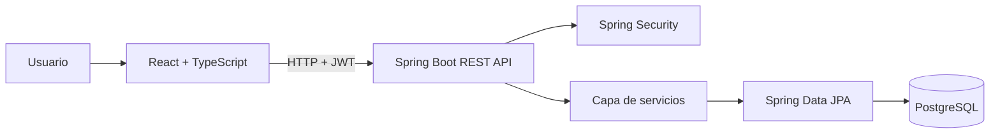
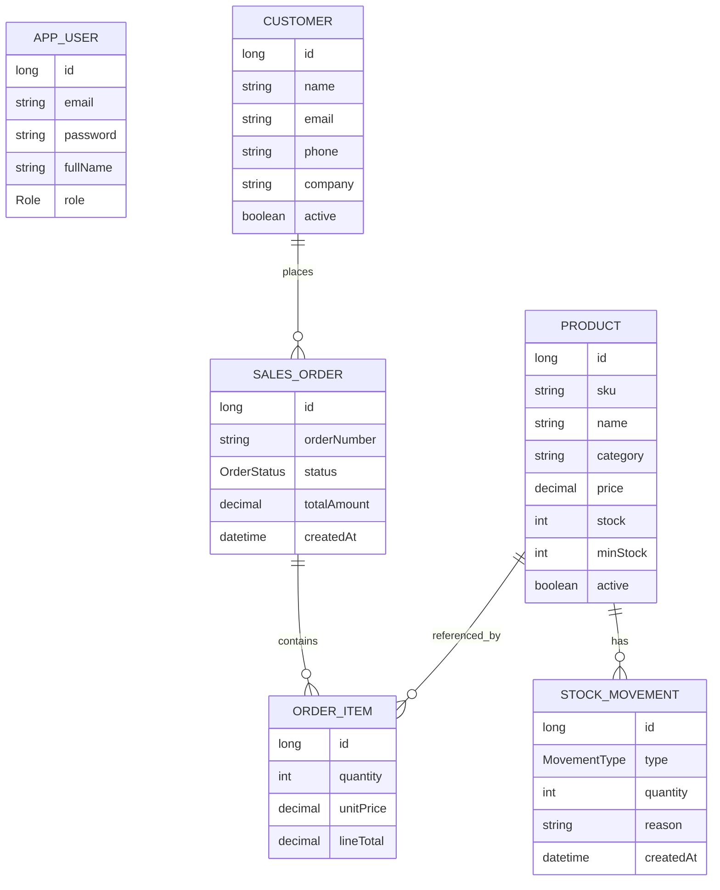
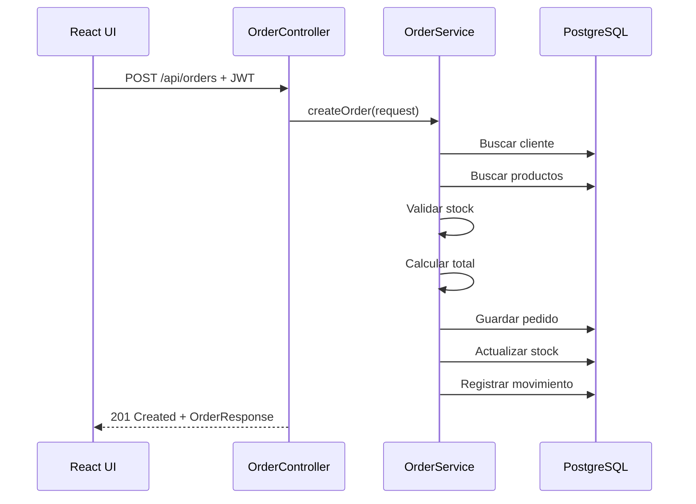

# Arquitectura técnica

## Objetivo

NexaStock se ha diseñado como una aplicación full stack mantenible, fácil de explicar en una entrevista y suficientemente realista para demostrar competencias profesionales.

## Vista general

## Capas del backend

### Controller

Responsable de exponer endpoints REST, recibir DTOs, validar datos y devolver respuestas HTTP.

### Service

Contiene la lógica de negocio:

- creación de pedidos,
- validación de stock,
- cálculo de importes,
- registro de movimientos,
- obtención de métricas.

### Repository

Abstracción de persistencia mediante Spring Data JPA.

### Domain / Entity

Modela el negocio: productos, clientes, pedidos, líneas de pedido, usuarios y movimientos de inventario.

## Modelo de dominio

## Seguridad

- El usuario realiza login en `/api/auth/login`.
- El backend valida credenciales con Spring Security.
- Se genera un token JWT firmado.
- El frontend guarda el token en `localStorage`.
- Las peticiones posteriores incluyen `Authorization: Bearer <token>`.
- El filtro JWT valida el token y establece el contexto de seguridad.

## Decisiones de diseño

### Por qué Java + Spring Boot

Es un stack muy utilizado en empresas para backend, banca, consultoría, APIs corporativas y aplicaciones de negocio.

### Por qué React + TypeScript

Permite construir una interfaz moderna, tipada, modular y fácilmente ampliable.

### Por qué Docker Compose

Permite levantar frontend, backend y base de datos con un único comando, facilitando revisión por reclutadores y pruebas locales.

### Por qué PostgreSQL

Es una base de datos relacional robusta, realista y más profesional para portfolio que una base embebida como única opción.

## Flujo de creación de pedido

## Criterios de calidad

- Código separado por responsabilidad.
- DTOs para no exponer directamente entidades.
- Validación con Bean Validation.
- Manejo centralizado de errores.
- Transacciones en operaciones críticas.
- Tests unitarios.
- Documentación técnica.
- Dockerización.
